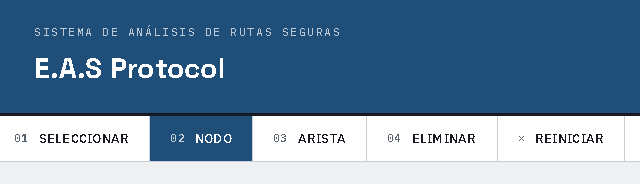
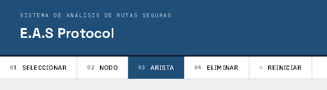
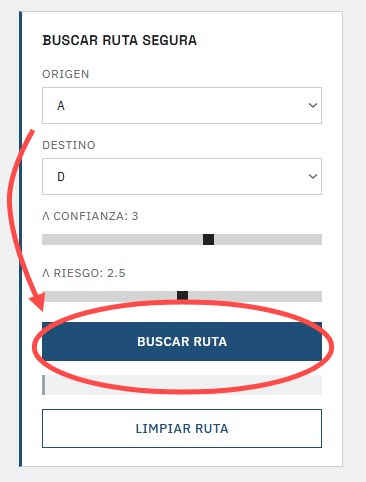

# E.A.S Protocol
### (Encrypted / Anti-Attack / Solving Protocol)

---

## Integrantes:

- Jair Gomez Narvaez
- Aimer Garcia Esteban Rojas
- Diego Alejandro Robayo Córdoba 

**Docente:** Jhoan Sebastián Tenjo García

---

## Descripción

**E.A.S Protocol (Efficient and Adaptive Secure Protocol)** es una aplicación desarrollada como proyecto para la asignatura **Matemáticas Discretas I** de la Universidad Nacional de Colombia. El sistema simula una red de comunicación representada mediante grafos dirigidos, permitiendo calcular y visualizar la ruta óptima entre dos nodos mediante una versión adaptada del algoritmo de Dijkstra y cifrar o descifrar los mensajes enviados por esa ruta.

Respecto al algoritmo de Dijkstra, a diferencia del algoritmo tradicional, la solución implementada considera no solo el peso de las aristas, sino también el nivel de riesgo de los enlaces y el nivel de confianza de los nodos, utilizando una función de costo personalizada que permite obtener rutas más seguras y eficientes.

Respecto a los algoritmos de criptografia, se implementaron dos esquemas fundamentados en aritmética modular, el cifrado afín, que cifra cada letra del mensaje mediante una transformación lineal módulo 26 y el cifrado hill, que cifra bloques de letras mediante multiplicación matricial en módulo 26, cuenta con soporte para claves de tamaños variables. Para ambos casos, se valida matemáticamente que la clave cumpla con los requisitos, garantizando que todos los mensajes cifrados, puedan descifrarse en el destino.

La aplicación ofrece una interfaz gráfica interactiva donde el usuario puede crear, editar y eliminar nodos y aristas, asignar sus atributos y ejecutar el algoritmo para visualizar paso a paso el proceso de búsqueda de la ruta óptima. Además, incorpora módulos de criptografía para el cifrado y descifrado de mensajes mediante diferentes algoritmos, fortaleciendo el enfoque de seguridad del proyecto.

El proyecto fue desarrollado utilizando **Python**, **Flask**, **JavaScript**, **HTML**, **CSS**, siguiendo una arquitectura modular que facilita el mantenimiento, la escalabilidad y la integración de nuevos componentes.

---

### Requisitos:
Para ejecutar el proyecto es necesario contar con:

- Python 3.10 o superior (version mas reciente si es posible).
- Git (opcional, para clonar el repositorio).
- Un navegador web moderno (Google Chrome, Microsoft Edge, Mozilla Firefox, etc).

Las dependencias del proyecto se encuentran definidas en el archivo `requirements.txt` y pueden instalarse mediante:

```bash
pip install -r requirements.txt
```

Entre las principales bibliotecas utilizadas se encuentran:

- Flask, para el desarrollo del servidor web y la API.
- NumPy (última versión estable), utilizado para operaciones matriciales y la implementación de los algoritmos criptográficos del proyecto.

---

### Instalación
1. Clonar el repositorio:

```bash
git clone https://github.com/DioRB/E.A.SProtocol.git
```

2. Acceder al directorio del proyecto:

```bash
cd E.A.SProtocol
```

3. Instalar las dependencias del proyecto:

```bash
pip install -r requirements.txt
```

---

### Ejecución
Una vez instaladas las dependencias, inicie el servidor ejecutando el siguiente comando desde la raíz del proyecto:

```bash
python src/main.py
```

Si la ejecución es correcta, Flask iniciará el servidor local. Abra su navegador y acceda a la siguiente dirección:

```
http://127.0.0.1:5000
```

Desde la interfaz web será posible crear y administrar grafos, configurar los parámetros de los nodos y aristas, ejecutar el algoritmo de Dijkstra adaptado y utilizar los módulos criptográficos implementados en la aplicación.

---

### Ejemplo de uso

**1. Crear Nodos**

Con la herramienta **Nodo** activa en la parte superior, se puede hacer clic sobre el lienzo del grafo. La aplicación solicitará el ID del nodo, una etiqueta descriptiva y su nivel de confianza. El nodo se crea automáticamente en la posición en donde se hizo clic. Este proceso se puede repetir para cada nodo que se desee agregar a la red.A




**2. Crear Aristas**

Con la herramienta **Arista** activa, se puede hacer clic primero sobre el nodo de origen y luego sobre el nodo de destino. La aplicación solicitará el peso de la conexión y el nivel de riesgo asociado, al finalizar, la arista se dibuja automáticamente entre los dos nodos seleccionados.




**3. Seleccionar y eliminar elementos**

Con la herramienta **Seleccionar**, se puede hacer clic sobre un nodo para ver su información completa en el panel lateral, datos como el ID, Etiqueta, Estado, Nivel de confianza, Cantidad de conexiones y Nodos vecinos. Con la herramienta **Eliminar**, dar clic sobre un nodo o arista solicita confirmación y lo elimina de la red.


**4. Buscar la ruta más segura**

En el panel **Buscar Ruta Segura**, se permite seleccionar un nodo de origen y un nodo de destino en la lista desplegable. Los sliders de confianza y riesgo permiten ajustar qué tanto penaliza el algoritmo los nodos poco confiables y las aristas riesgosas, manejando un rango entre 0 y 5. Al presionar **Buscar Ruta**, se anima paso a paso el proceso de búsqueda del algoritmo sobre el grafo y al finalizar se resalta la ruta óptima encontrada junto con un panel de resultados que incluye la secuencia de nodos para llegar al destino, el costo total y algunas métricas como lo son el peso, el riesgo y la penalización por confianza junto a un análisis de la ruta.A



**5. Cifrar un mensaje**

Antes de empezar la búsqueda, es posible activar la casilla de cifrado de mensaje, ubicada debajo del panel del grafo, al marcarla, se despliega un bloque donde se puede elegir entre dos algoritmos de cifrado, **Afín** y **Hill**. Al elegir alguno de estos, se puede ingresar la clave correspondiente para cada cifrado, siguiendo las siguientes condiciones:

- **Afín:** Dos valores enteros, a y b, a debe ser comprimo con 26 para que la clave sea válida.
- **Hill:** Un tamaño de matriz n entre 2 y 7, esto despliega una cuadrícula de celdas donde se ingresa cada valor de la matriz clave. La matriz debe tener determinante invertible en aritmética modular 26 para que sea válida.
- Se debe escribir un mensaje a cifrar en el campo de texto.

A medida que se escribe el mensaje o se modifica la clave, el sistema muestra una vista previa del texto cifrado. Si la clave ingresada no cumple con las condiciones, se muestra un mensaje de error en lugar del cifrado.

Al ejecutar la búsqueda con el cifrado activado, el resultado incluye adicionalmente el mensaje cifrado enviado junto a la ruta, también aparece un botón para descifrar, el cuál permite verificar que el mensaje se puede recuperar correctamente usando la misma clave que se digitó a la hora de cifrar el mensaje.


---

### Estado Actual del Proyecto
 
- Implementación del algoritmo de Dijkstra adaptado.
- Visualización interactiva de grafos.
- Animación paso a paso del algoritmo.
- Cálculo de rutas considerando peso, riesgo y confianza.
- Implementación de módulos criptográficos.
- Integración entre frontend y backend.
- Pruebas de funcionamiento realizadas.
- **Proyecto finalizado para los objetivos de la asignatura.**